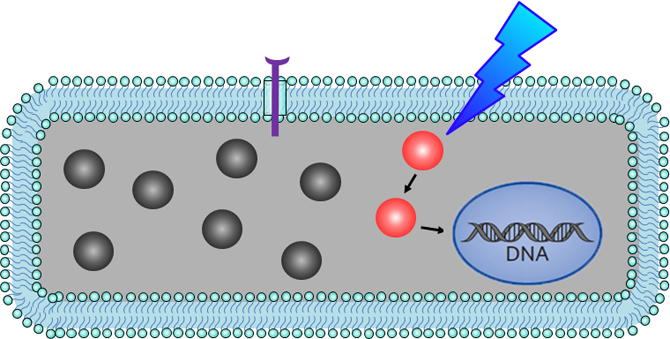

# LED-based-Gear
*Equipment to help study the optical control of protein function*

This repo contains the material to produce and use the devices used in the [Cui Lab](https://cuilab.stanford.edu) at Stanford for studying the optical control of protein function. You can learn more about their work [here](https://cuilab.stanford.edu/optical-control-protein-function) but briefly-

### Optical Control of Protein Function

Cells constantly process environmental cues, such as growth factors, to make decisions on cell fate, e.g. survival, proliferation, differentiation, migration, and apoptosis. To ensure proper conversion of a specific environmental input into a distinct cellular output, the activation of intracellular signaling pathways is tightly regulated in space and time.

Compared with our understanding of the roles various proteins play in a multitude of cellular signaling pathways, much less is understood about how these temporal and spatial aspects affect cell behavior, largely due to the lack of effective tools to precisely regulate signaling pathways in space and time.

Our approach is to use light-gated protein-protein interaction systems to control the activation and inactivation of intracellular signaling pathways. This ability to optically control signaling pathways offers unprecedented precision in temporal and spatial dimensions.

### Devices to provide controlled illumination

Controllable illumination sources are required to work in conjuntion with the molecular tools used in the Cui Lab. Specifically, a light source with tunable intensity and on/off durations is desired for spatiotemporal control of the activation of these molecular tools in cells. Simple light sources are readily made using electronic prototyping techniques but there is a desire to gain more precise control of the illumination, so we (folks in lab64) have been helping produce the equipment described here.

### About lab64
lab64 is an electronics and systems makerspace located in the David Packard Electical Engineering Building at Stanford. Occasionally we have the privilege of helping to build equipment to support some of the exciting research projects here on campus. This is one of those projects!

#### Questions or comments
If you have questions about the hardware, firmware, or software described here, please send Steve Clark a note at steven DOT clark AT stanford DOT edu

If you have questions about the research, molecular tools, etc. please contact Professor Cui by sending a note to bcui AT stanford DOT edu

Thank you for your interest!
